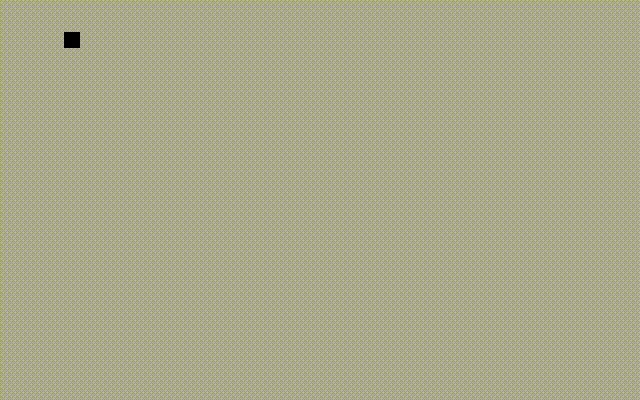

# BootMine

*Ever wanted to play minesweeper but didn't have an OS to run it in? No? Really no??*

BootMine is an entire minesweeper game crammed into 512 bytes, the size of a BIOS boot sector. It can boot on any PC that supports BIOS booting, without running inside an OS. In a sense, BootMine is its own OS that can do nothing but run minesweeper.



## Controls

| Key                                                 | Action                                                          |
|-----------------------------------------------------|-----------------------------------------------------------------|
| <kbd>Space</kbd>                                    | 🔲 Clear cell                                                  |
| <kbd>↑</kbd> <kbd>↓</kbd> <kbd>←</kbd> <kbd>→</kbd> | 🕹 Move cursor                                                 |
| <kbd>Enter</kbd>                                    | 🚩 Place flag                                                  |
| <kbd>R</kbd>                                        | 💣 Restart game (only works on GAME WIN and GAME OVER screens) |

## Building

Make sure `nasm` and `make` are installed, then run:

```sh
make
```

## Installing

The 512-byte file `bootmine.img` can be written to the first sector of a floppy disk (or USB drive), with a command like `dd if=bootmine.img of=/dev/sdb`. Keep in mind that this will effectively destroy all data on the drive.

### Emulation

Makefile targets are provided for emulating in QEMU and Bochs.

```sh
make qemu
```

```sh
make bochs
```

**NOTE**: The way Bochs implements the `rdtsc` instruction appears to be bad as a source of entropy, so the bomb locations are predictable.

## DOS

BootMine has DOS support too! Running `make` also produces `bootmine.com` that can be run in DOS. There are Makefile targets for easily running in DOSBox and DOSEMU.

```sh
make dosbox
```

```sh
make dosemu
```

## Links

* [Hacker News discussion](https://news.ycombinator.com/item?id=23360133)

## Credits

* [nanochess](https://github.com/nanochess), for his excellent collection of boot sector games
* Curt Johnson and Robert Donner, for [*Microsoft Minesweeper*](https://en.wikipedia.org/wiki/Microsoft_Minesweeper), popularizing the game
